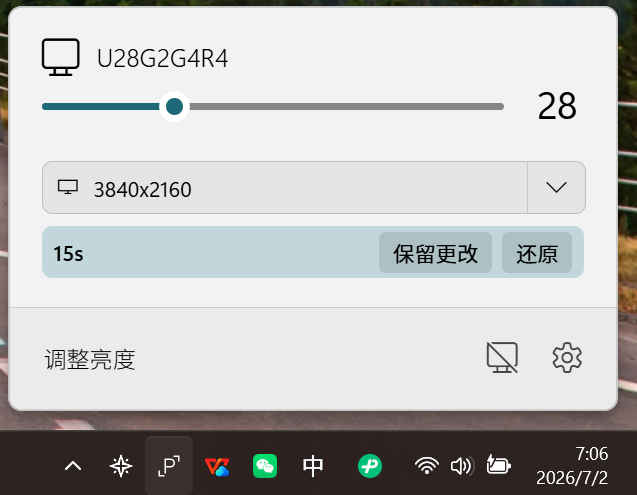
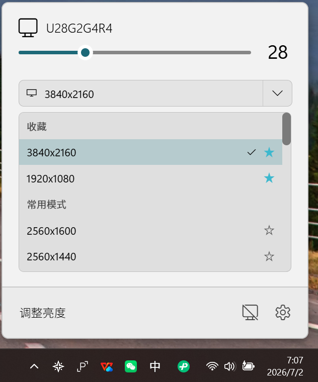

# Twinkle Tray Resolution Enhanced

中文文档：[README.md](README.md)

This project is a secondary development version based on [xanderfrangos/twinkle-tray](https://github.com/xanderfrangos/twinkle-tray) `1.17.2`. It keeps the original external monitor brightness control, tray panel, hotkeys, monitor settings, and localization support, while adding resolution and refresh-rate display and switching features.

This project is not the official `xanderfrangos/twinkle-tray` release. For the official app, official documentation, or upstream issue reporting, please visit:

- Upstream repository: [xanderfrangos/twinkle-tray](https://github.com/xanderfrangos/twinkle-tray)
- Upstream website: [twinkletray.com](https://twinkletray.com/)
- Upstream Wiki: [Twinkle Tray Wiki](https://github.com/xanderfrangos/twinkle-tray/wiki)






## Main Enhancements

### Resolution and Refresh-Rate Display

The tray brightness panel shows the current resolution and refresh rate inside each supported monitor card. The resolution entry is compact and attached to the existing monitor card, so brightness adjustment remains the primary workflow.

### Resolution and Refresh-Rate Switching

Click the resolution area in a monitor card to expand the available display modes for that monitor. Each mode shows resolution and refresh rate on the same line, and the current mode is clearly selected.

Display-mode switching uses Windows display configuration APIs instead of DDC/CI. DDC/CI remains used for original monitor controls such as brightness and contrast.

### Confirmation and Automatic Rollback

After a resolution change, the app starts a confirmation flow. If the new mode causes display problems, the user does not confirm it, or the panel is closed before the timer ends, the app attempts to restore the previous display configuration.

The rollback timer is maintained by the main process and does not depend on the tray panel staying open.

### Resolution Settings and Favorites

The settings window includes resolution options for showing the resolution control, showing refresh rates, filtering low refresh-rate modes, showing only favorite modes, and configuring the rollback timeout.

Favorite modes are saved per monitor, making common resolution and refresh-rate combinations easier to reuse.

### Hotkey Support for Favorite Modes

Hotkey actions include a resolution switching action. You can select a monitor and one of its favorite modes, then switch to it with a global hotkey.

### Simplified Chinese by Default

This build is oriented toward Chinese usage. New installations or profiles without previous settings use Simplified Chinese by default. The original language selector remains available, so users can still switch to system language, English, or other bundled languages.

### Upstream Update Checks Disabled

This project no longer targets the upstream Twinkle Tray update channel. Upstream update UI is hidden for regular users, and checks, downloads, and installers from upstream GitHub Releases are blocked to avoid accidentally replacing this build with the official version.

## Original Features

This project keeps the main features from the original Twinkle Tray:

- Control external monitor brightness from the Windows 10 and Windows 11 system tray.
- Bind hotkeys to adjust brightness for specific or all displays.
- Automatically adjust brightness based on time, idle state, or profiles.
- Normalize backlight across different monitors.
- Control some DDC/CI features such as contrast.
- Start with Windows.
- Match light, dark, and Windows-version-specific visual styles.

## Using Resolution Switching

### 1. Open the Tray Panel

Start the app and click the Twinkle Tray icon in the system tray.

### 2. Expand the Mode List

In a monitor card, click the small arrow next to the current resolution and refresh-rate label to expand available modes.

### 3. Pick a Target Mode

Choose the resolution and refresh rate you want. The current mode is marked, and long mode lists can be scrolled.

### 4. Confirm or Let It Roll Back

If the new display mode works correctly, confirm it in the confirmation bar. If it does not work or is not confirmed, the app attempts to restore the previous mode after the countdown.

### 5. Configure Favorites and Hotkeys

Use the settings window to tune resolution options, then configure global hotkeys for favorite resolution modes.

## Usage Notes

- Resolution switching depends on Windows display configuration APIs and is mainly intended for Windows 10 and Windows 11.
- Brightness control still depends on DDC/CI, WMI, or the original monitor-control mechanisms. Some monitors, docks, remote desktops, or cast displays may only support part of the feature set.
- Before switching resolution, make sure the target display connection is stable.
- If the display becomes abnormal after switching, wait for automatic rollback instead of force-quitting the app immediately.
- For hotkeys, prefer favorite modes to avoid accidentally choosing low-value or unstable display modes.
- This is a secondary development build. The official Twinkle Tray Microsoft Store, winget, Chocolatey, and Scoop channels do not represent this project's release channel.

## Build Instructions

This project must be built on Windows.

```powershell
npm install
npm run parcel-build
npm run electron-build
```

Development run:

```powershell
npm run dev
```

Full build:

```powershell
npm run build
```

## Compatibility

The original Twinkle Tray communicates with monitors through DDC/CI and WMI. Most monitors support DDC/CI, but it may need to be enabled in the monitor's on-screen settings.

Known situations that may affect monitor control include:

- DDC/CI is disabled on the monitor.
- VGA/DVI, some USB/Thunderbolt/Surface docks, or adapter chains do not fully support monitor control.
- GPU control panels or third-party display tools take over color, brightness, or display configuration.
- Remote desktop, virtual displays, cast displays, or unknown devices may not fully support resolution switching.

## Acknowledgements

Thanks to the sincere, friendly, united, and professional [LinuxDo community](https://linux.do/latest), where I have learned a great deal about AI-related knowledge and practices.

## License

This project is based on the upstream Twinkle Tray source code and follows the upstream MIT License. See [LICENSE](LICENSE) for details.

Original project copyright:

Copyright © 2020 Xander Frangos
