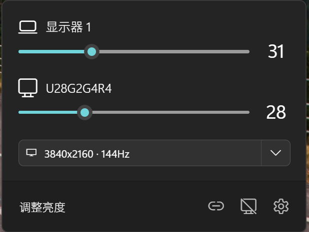

# Twinkle Tray 分辨率增强版

中文 | [English](README.en.md) 

本项目基于 [xanderfrangos/twinkle-tray](https://github.com/xanderfrangos/twinkle-tray) 的 `1.17.2` 版本二次开发，保留原版外接显示器亮度控制、托盘面板、快捷键、显示器配置和本地化能力，并在原版基础上增加了分辨率/刷新率显示与切换功能。

本项目不是 `xanderfrangos/twinkle-tray` 官方原版。如果需要官方版本、官方文档或官方问题反馈，请访问上游项目：

- 上游仓库：[xanderfrangos/twinkle-tray](https://github.com/xanderfrangos/twinkle-tray)
- 上游官网：[twinkletray.com](https://twinkletray.com/)
- 上游 Wiki：[Twinkle Tray Wiki](https://github.com/xanderfrangos/twinkle-tray/wiki)

English documentation: [README.en.md](README.en.md)



## 主要增强功能

### 分辨率与刷新率显示

托盘亮度面板会在每个支持的显示器卡片中显示当前分辨率和刷新率。分辨率入口采用紧凑的分段展开形态，保留原有亮度滑块作为主操作区，不额外打开独立大面板。

### 分辨率/刷新率切换

点击显示器卡片中的分辨率区域后，可以展开该显示器支持的显示模式列表。模式列表会把分辨率和刷新率放在同一行展示，并标记当前正在使用的模式。

切换分辨率或刷新率时，程序会通过 Windows 显示配置能力应用目标模式，而不是通过 DDC/CI。DDC/CI 仍只用于亮度、对比度等原版显示器控制能力。

### 确认与自动回滚

分辨率切换后会进入确认流程。如果切换后的画面异常、用户没有确认，或者面板关闭后倒计时结束，程序会尝试恢复切换前的显示配置。

这个回滚流程由主进程维护，不依赖托盘面板是否保持打开。

### 分辨率设置与收藏

设置页中提供分辨率相关选项，可控制是否显示分辨率入口、是否显示刷新率、是否过滤低刷新率模式、是否只显示收藏模式，以及自动回滚等待时间。

收藏模式按显示器保存，适合把常用的分辨率/刷新率组合加入快捷入口。

### 快捷键切换收藏模式

快捷键动作中新增“切换分辨率”能力。你可以为指定显示器选择收藏模式，并通过全局快捷键快速切换。

### 默认简体中文

本项目面向中文使用场景，新安装或没有历史设置时默认使用简体中文。仍保留原版语言选择器，用户可以在设置页切换为系统语言、英文或其它已有语言。

### 关闭上游更新检查

本项目不再面向 Twinkle Tray 上游更新渠道，普通用户界面中隐藏上游更新入口，并阻断对上游 GitHub Releases 的检查、下载和安装链路，避免二开版本被误更新为官方版本。

## 基础功能

本项目保留 Twinkle Tray 原版主要能力：

- 在 Windows 10 和 Windows 11 托盘中控制外接显示器亮度。
- 为不同显示器绑定亮度调节快捷键。
- 根据时间、空闲状态或配置自动调整亮度。
- 统一多显示器背光表现。
- 控制部分 DDC/CI 功能，例如对比度。
- 支持随 Windows 启动。
- 支持浅色、深色和 Windows 版本风格适配。

## 分辨率功能使用方法

### 1. 打开托盘面板

启动应用后，点击系统托盘中的 Twinkle Tray 图标，打开亮度面板。

### 2. 展开显示模式列表

在对应显示器卡片中，点击当前分辨率/刷新率右侧的小箭头，展开该显示器可用的显示模式列表。

### 3. 选择目标模式

在列表中选择需要的分辨率和刷新率。当前模式会有明确选中态，列表较长时可以滚动查看。

### 4. 确认或等待回滚

切换后，如果显示正常，请在确认条中确认保留新模式。如果画面异常或未确认，程序会在倒计时结束后尝试恢复原始模式。

### 5. 配置收藏与快捷键

进入设置页后，可以在显示器相关设置中调整分辨率功能选项，并在快捷键设置中为收藏分辨率配置全局快捷键。

## 使用提示

- 分辨率切换依赖 Windows 显示配置能力，主要适用于 Windows 10 和 Windows 11。
- 亮度控制仍依赖 DDC/CI、WMI 或原版已有的显示器控制能力；某些显示器、扩展坞、远程桌面或投屏设备可能只支持部分功能。
- 切换分辨率前建议先确认显示器处于稳定连接状态。
- 如果切换后画面异常，请等待自动回滚，不要立即强制退出应用。
- 快捷键切换分辨率建议优先绑定收藏模式，避免误选低价值或不稳定模式。
- 本项目是二开版本，官方 Twinkle Tray 的 Microsoft Store、winget、Chocolatey、Scoop 等安装渠道不代表本项目发布渠道。

## 构建说明

本项目需要在 Windows 环境中构建。

```powershell
npm install
npm run parcel-build
npm run electron-build
```

开发运行：

```powershell
npm run dev
```

如需完整打包，可使用：

```powershell
npm run build
```

## 兼容性说明

Twinkle Tray 原版使用 DDC/CI 和 WMI 与显示器通信。多数显示器支持 DDC/CI，但可能需要在显示器菜单中手动开启。

已知可能影响显示器控制的情况包括：

- 显示器关闭了 DDC/CI。
- VGA/DVI、部分 USB/Thunderbolt/Surface 扩展坞或转接链路不完整支持显示器控制。
- 显卡控制面板或第三方显示器软件接管了颜色、亮度或显示配置。
- 远程桌面、虚拟显示器、投屏设备或未知设备可能无法完整支持分辨率切换。

## 特别感谢

本项目基于 Twinkle Tray 二次开发。感谢 [Xander Frangos](https://github.com/xanderfrangos) 和 Twinkle Tray 的所有贡献者，以及 Electron、React、Node.js、node-ddcci、win32-displayconfig 等项目。

## 许可证

本项目基于上游 Twinkle Tray 源码二次开发，许可证沿用上游项目的 MIT License。详情请查看 [LICENSE](LICENSE)。

原项目版权归属：

Copyright © 2020 Xander Frangos
